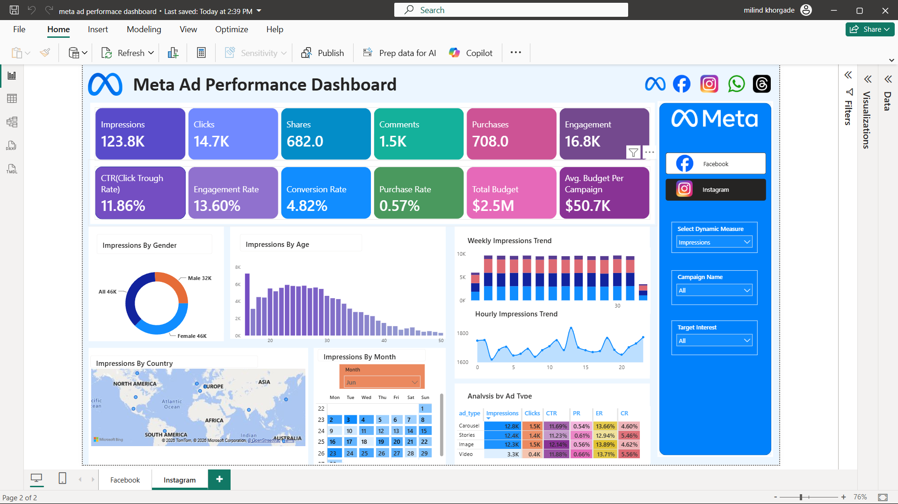

# 📊 Meta Ad Performance Analytics Dashboard

<div align="center">


**An Interactive Business Intelligence Dashboard built using Power BI to analyze Meta (Facebook & Instagram) advertising campaign performance through KPIs, demographic analysis, geographic insights, and campaign trends.**

</div>

---

# 📸 Dashboard Preview

<p align="center">

</p>

---

# 📖 Project Overview

Digital advertising generates a massive amount of campaign data. Converting that data into meaningful business insights helps marketing teams improve campaign performance, optimize budgets, and increase conversions.

This project presents an interactive **Meta Ad Performance Dashboard** developed in **Power BI** that enables users to monitor advertising performance across multiple dimensions including:

- Campaign Performance
- Audience Demographics
- Geographic Distribution
- Time-Based Trends
- Advertisement Types
- Budget Utilization
- Conversion Funnel

The dashboard allows marketers and analysts to quickly identify high-performing campaigns and make data-driven decisions.

---

# 🎯 Business Objective

The objective of this dashboard is to:

- Monitor campaign performance using key marketing KPIs.
- Analyze customer engagement across different demographics.
- Identify the best-performing advertisement formats.
- Track conversion efficiency throughout the marketing funnel.
- Optimize advertising budget allocation.
- Support strategic business decisions through interactive visualizations.

---

# 🛠️ Tech Stack

| Tool | Purpose |
|-------|----------|
| Power BI | Dashboard Development |
| Power Query | Data Cleaning & Transformation |
| DAX | Calculated Measures & KPIs |
| Excel / CSV | Dataset |
| SQL | Data Analysis & Querying |

---

# 📂 Dataset

The project uses multiple CSV datasets representing different entities of a Meta advertising system.

Datasets include:

- ads.csv
- campaigns.csv
- users.csv
- ad_events.csv

These datasets are integrated within Power BI to create a unified analytical model.

---

# 📈 Key Performance Indicators (KPIs)

The dashboard tracks multiple business metrics including:

- Impressions
- Clicks
- Shares
- Comments
- Purchases
- Engagement
- Click Through Rate (CTR)
- Engagement Rate
- Conversion Rate
- Purchase Rate
- Total Budget
- Average Budget per Campaign

These KPIs provide a complete overview of campaign effectiveness from awareness to conversion.

---

# 📊 Dashboard Features

### Executive KPI Cards

- Total Impressions
- Total Clicks
- Total Engagement
- Purchases
- Budget
- CTR
- Engagement Rate
- Conversion Rate
- Purchase Rate

---

### Audience Analysis

- Engagement by Gender
- Engagement by Age Group

---

### Geographic Analysis

- Interactive Country Map
- Regional Performance Comparison

---

### Time Analysis

- Weekly Trend Analysis
- Hourly Trend Analysis
- Monthly Calendar View

---

### Advertisement Performance

Performance comparison between:

- Carousel Ads
- Image Ads
- Stories
- Video Ads

---

### Interactive Filters

Users can dynamically filter dashboard data using:

- Platform
- Campaign Name
- Target Interest
- Dynamic KPI Selector

---

# 📊 Business Insights

The dashboard provides several actionable business insights:

- High impressions indicate strong campaign visibility.
- Strong CTR suggests attractive advertisement creatives.
- Engagement is concentrated among younger audiences.
- Female audiences demonstrate comparatively higher engagement.
- Video advertisements deliver stronger overall performance.
- Stories generate high reach with consistent engagement.
- Afternoon and evening campaigns show better audience interaction.
- Geographic analysis highlights regions with higher campaign activity.

These insights can help marketing teams optimize campaign strategy and improve return on investment.

---

# 💡 Business Recommendations

Based on dashboard analysis:

- Increase investment in high-performing advertisement formats.
- Improve landing pages to enhance conversion efficiency.
- Focus campaigns on highly engaged audience segments.
- Schedule campaigns during peak engagement hours.
- Optimize campaign budgets based on regional performance.
- Continuously monitor campaign KPIs for data-driven decision making.

---

# ✨ Dashboard Highlights

✔ Interactive Power BI Dashboard

✔ Dynamic KPI Selection

✔ Responsive Filters

✔ Marketing Funnel Analysis

✔ Geographic Visualization

✔ Time Series Analysis

✔ Demographic Analysis

✔ Campaign Comparison

✔ Business Intelligence Reporting

---

# 📁 Repository Structure

```
Meta-Ad-Performance-Analytics-Dashboard
│
├── Dashboard
│   └── Meta Ad Performance Dashboard.pbix
│
├── Dataset
│   ├── ads.csv
│   ├── campaigns.csv
│   ├── users.csv
│   └── ad_events.csv
│
├── Images
│   └── dashboard.png
│
├── README.md
└── LICENSE
```

---

# 🚀 Getting Started

### Clone Repository

```bash
git clone https://github.com/YOUR_USERNAME/Meta-Ad-Performance-Analytics-Dashboard.git
```

### Open Dashboard

Open the `.pbix` file using **Microsoft Power BI Desktop**.

---

# 📚 Skills Demonstrated

- Business Intelligence
- Dashboard Design
- Data Visualization
- Data Cleaning
- Data Transformation
- DAX Measures
- Power Query
- Marketing Analytics
- KPI Reporting
- Data Storytelling

---

# 🎯 Learning Outcomes

Through this project, I strengthened my understanding of:

- Building professional Power BI dashboards
- Creating interactive reports
- Designing marketing KPI dashboards
- Implementing DAX calculations
- Data modeling and relationships
- Business insight generation
- Dashboard storytelling

---

# 📌 Future Improvements

- Real-time API integration
- Marketing ROI Dashboard
- Customer Segmentation
- Predictive Analytics
- Campaign Forecasting
- Automated Refresh
- Mobile Dashboard Optimization

---

# 🙋‍♂️ Author

**Milind Khorgade**

B.Tech Artificial Intelligence & Machine Learning

Aspiring Data Analyst | Power BI | SQL | Python

GitHub: https://github.com/YOUR_USERNAME

LinkedIn: *(Add your LinkedIn profile here)*

---

# ⭐ Support

If you found this project useful, consider giving it a ⭐ on GitHub.

It motivates me to build and share more data analytics projects.

---

## 📄 License

This project is intended for educational and portfolio purposes.
